# Episodive
Podcast Index Api 활용한 팟캐스트 앱

# 화면

| 화면       | 스크린샷                          |
|:---------|:------------------------------|
| **홈**    |       |
| **검색**   | 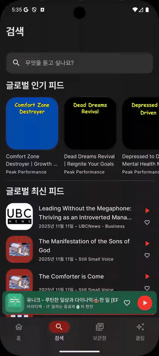   |
| **보관함**  |  |
| **클립**   |      |
| **플레이어** |  |

|       화면       | 스크린샷                                                                                                                                                                                                                                                                                                                                                                                                       |
|:--------------:|:-----------------------------------------------------------------------------------------------------------------------------------------------------------------------------------------------------------------------------------------------------------------------------------------------------------------------------------------------------------------------------------------------------------|
| **OnBoarding** | 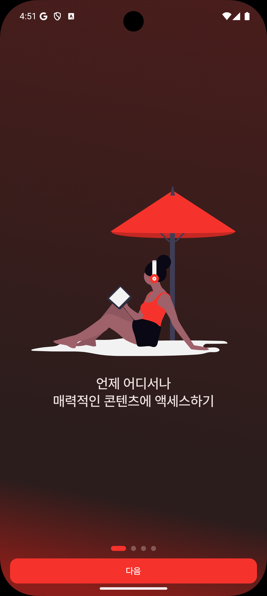 &nbsp;&nbsp; 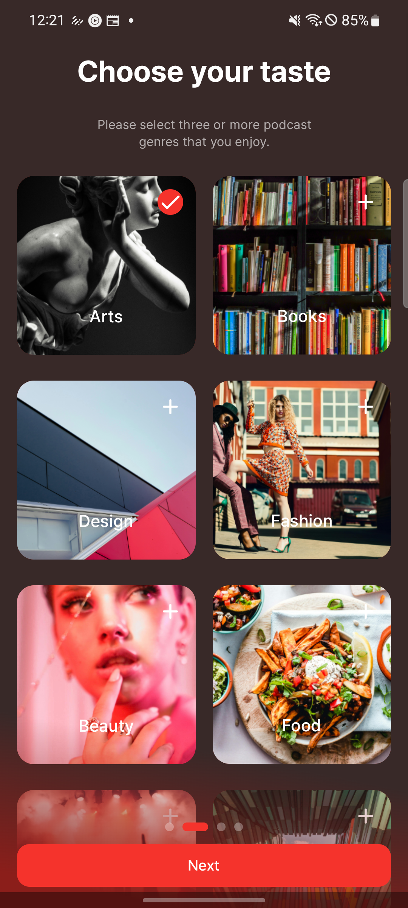 &nbsp;&nbsp; 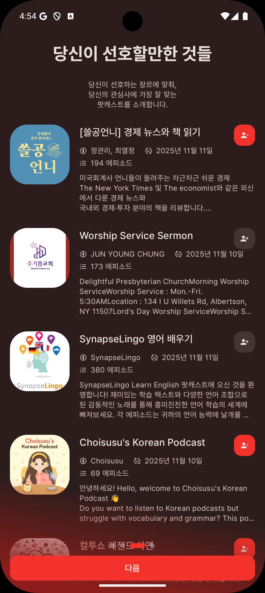 &nbsp;&nbsp; 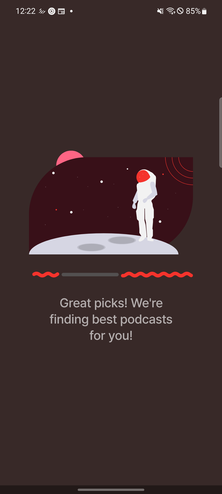                                                                |
|    **Home**    | 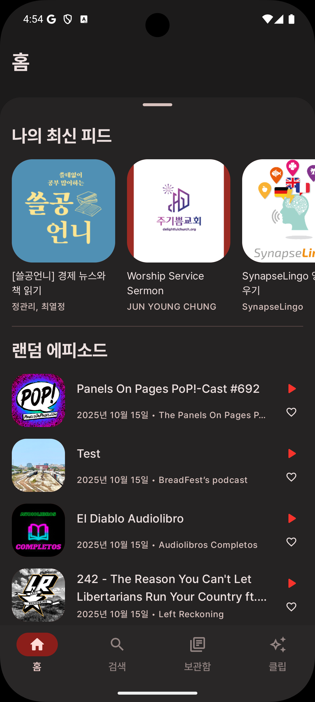  &nbsp;&nbsp; 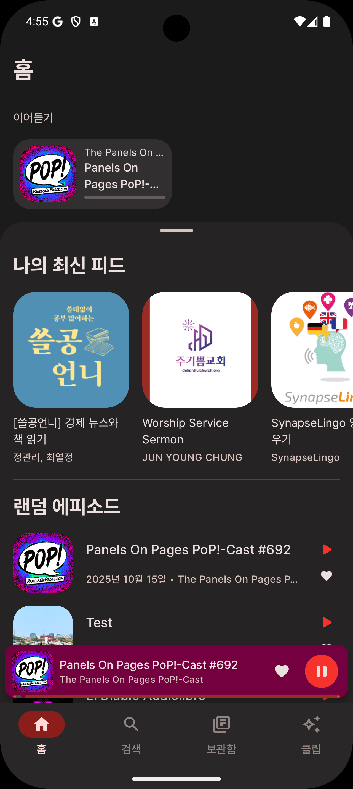                                                                                                                                                                                                                                                        |
|   **Search**   | 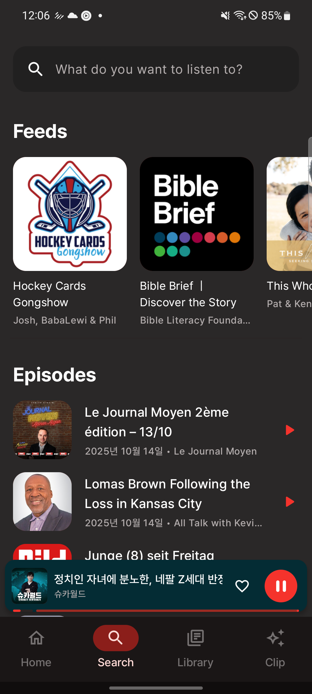 &nbsp;&nbsp; 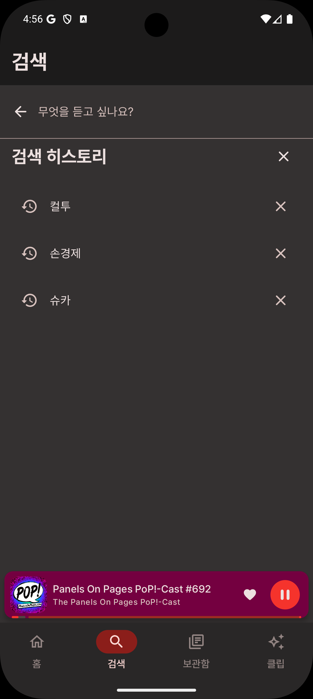 &nbsp;&nbsp; 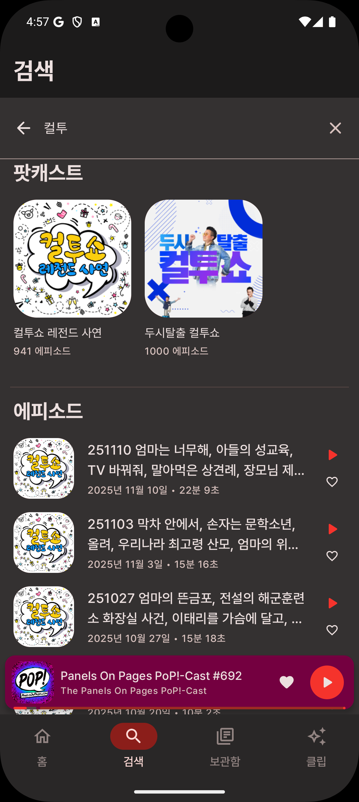                                                                                                                                                                      |
|  **Library**   | 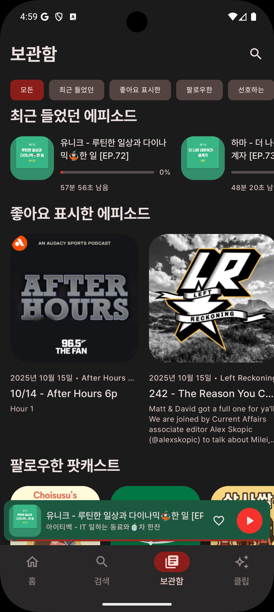 &nbsp;&nbsp; 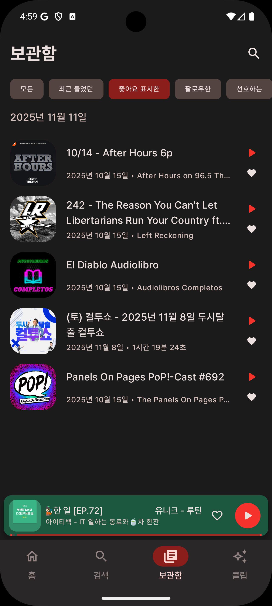 &nbsp;&nbsp; 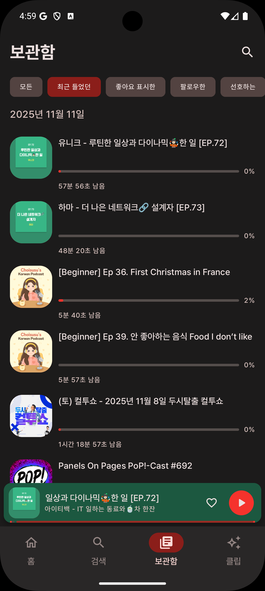 &nbsp;&nbsp; 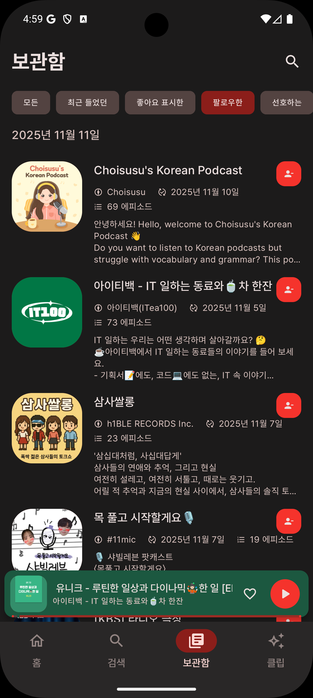 &nbsp;&nbsp; 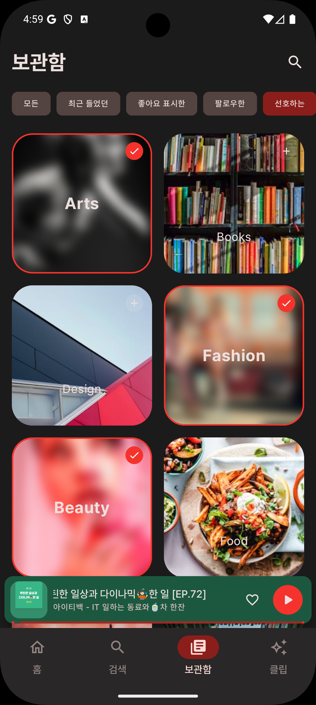 |
|    **Clip**    | 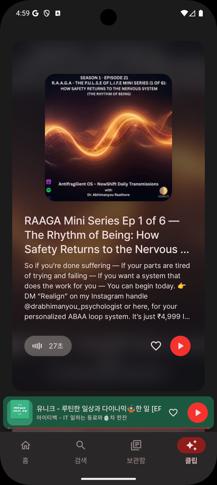                                                                                                                                                                                                                                                                                                                                                  |
|  **Podcast**   | 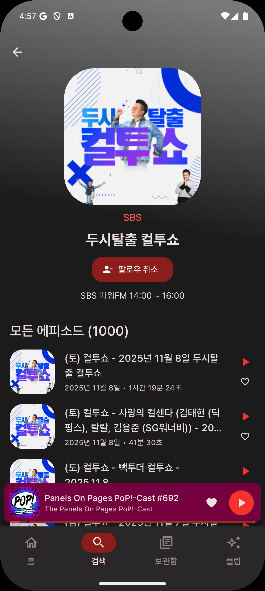                                                                                                                                                                                                                                                                                                                                               |
|   **Player**   | 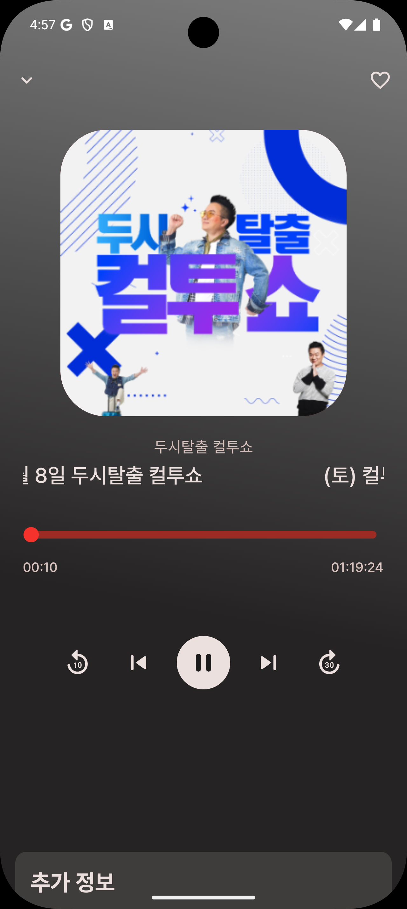 &nbsp;&nbsp; 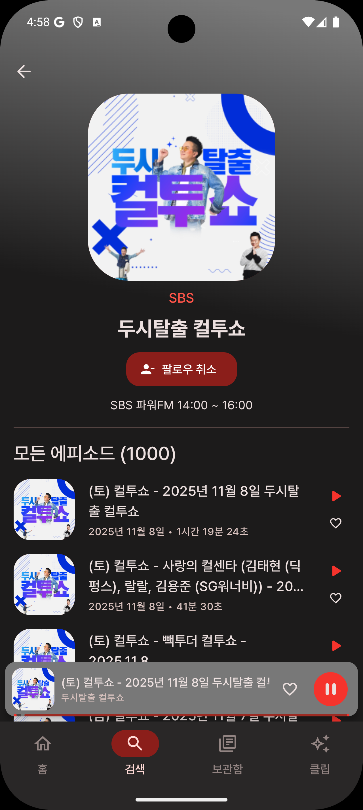                                                                                                                                                                                                                                                            |

# 주요 기능

- **온보딩**: 선호 카테고리 및 팟캐스트 선택으로 개인화된 경험 제공
- **홈**: 최근 재생 에피소드, 트렌딩 팟캐스트, 랜덤 에피소드, 라이브 방송 등 다양한 콘텐츠 피드
- **검색**: 팟캐스트 및 에피소드 검색, 최근 검색 히스토리, 최신 콘텐츠 탐색
- **라이브러리**: 구독, 좋아요, 재생 기록 등 사용자 데이터 관리
- **팟캐스트 상세**: 팟캐스트 정보 및 에피소드 목록 제공
- **오디오 플레이어**: ExoPlayer 기반의 백그라운드 재생 지원

# 아키텍처

Episodive는 Clean Architecture와 MVI 패턴을 기반으로 구축되었습니다.

## 계층 구조

```
UI Layer (Feature Modules) - MVI Pattern
    ↓
Domain Layer (:core:domain) - Use Cases & Repository Interfaces
    ↓
Data Layer (:core:data) - Repository Implementations
    ↓
Data Sources: Network (:core:network) | Database (:core:database) | DataStore (:core:datastore)
```

## 핵심 원칙

- **MVI (Model-View-Intent)**: Intent → ViewModel → State → UI의 단방향 데이터 흐름
- **Single Source of Truth**: Room Database를 로컬 데이터의 신뢰할 수 있는 단일 소스로 활용
- **Offline First**: 네트워크 응답을 로컬 DB에 캐싱하여 오프라인 지원
- **Reactive Programming**: Kotlin Flow로 반응형 데이터 스트림 구현

# 모듈 구조

## Core Modules

| 모듈                   | 설명                                                        |
|:---------------------|:----------------------------------------------------------|
| `:core:model`        | 도메인 모델 및 데이터 클래스 (Podcast, Episode, Category, UserData 등) |
| `:core:domain`       | 비즈니스 로직 인터페이스 및 Repository 계약                             |
| `:core:data`         | Repository 구현체 (Network, Database, DataStore 조율)          |
| `:core:network`      | Retrofit 기반 Podcast Index API 통신                          |
| `:core:database`     | Room 기반 로컬 데이터베이스 (DAOs, Entities)                        |
| `:core:datastore`    | DataStore 기반 사용자 설정 관리                                    |
| `:core:player`       | ExoPlayer 기반 오디오 재생                                       |
| `:core:designsystem` | 공통 UI 컴포넌트 및 테마                                           |
| `:core:testing`      | 테스트 유틸리티 및 테스트 데이터                                        |

## Feature Modules

| 모듈                    | 설명                    |
|:----------------------|:----------------------|
| `:feature:onboarding` | 온보딩 플로우 및 카테고리 선택     |
| `:feature:home`       | 홈 화면 및 다양한 팟캐스트 피드    |
| `:feature:search`     | 검색 및 탐색 기능            |
| `:feature:library`    | 사용자의 저장 및 좋아요 에피소드 관리 |
| `:feature:podcast`    | 팟캐스트 상세 정보 및 에피소드 목록  |
| `:feature:player`     | 오디오 플레이어 UI           |
| `:feature:clip`       | 사운드바이트 및 클립           |

## App Module

| 모듈     | 설명                             |
|:-------|:-------------------------------|
| `:app` | 네비게이션 및 의존성 통합을 담당하는 메인 애플리케이션 |

# 기술 스택

## Android

- **Minimum SDK**: 28 (Android 9.0 Pie)
- **Target SDK**: 35 (Android 15)
- **Language**: Kotlin
- **UI Framework**: Jetpack Compose

## 핵심 라이브러리

- **Dependency Injection**: Hilt
- **Networking**: Retrofit + OkHttp
- **Local Database**: Room
- **Preferences**: DataStore
- **Audio Playback**: ExoPlayer (Media3)
- **Asynchronous**: Kotlin Coroutines + Flow
- **Image Loading**: Coil
- **Serialization**: Kotlinx Serialization

## 테스트

- **Unit Testing**: JUnit4, MockK, Turbine
- **Database Testing**: Robolectric
- **Test Coverage**: Jacoco

## 빌드 시스템

- **Gradle Version Catalog**: 의존성 중앙 관리
- **Convention Plugins**: 모듈별 일관된 빌드 설정
  - `episodive.android.application` - Application 모듈
  - `episodive.android.feature` - Feature 모듈 (Compose + Hilt + Test + Jacoco)
  - `episodive.android.library` - 표준 라이브러리 모듈
  - `episodive.android.room` - Room 데이터베이스 설정
  - `episodive.android.hilt` - Hilt DI 설정

# API 설정

이 앱은 [Podcast Index API](https://podcastindex.org/)를 사용합니다.

## API 키 설정 방법

1. [Podcast Index](https://podcastindex.org/)에서 회원가입 후 API 키 발급
2. 프로젝트 루트에 `local.properties` 파일 생성 (이미 있다면 추가)
3. 다음 내용 추가:
   ```properties
   PODCAST_INDEX_API_KEY=your_api_key
   PODCAST_INDEX_API_SECRET=your_api_secret
   ```

**주의**: `local.properties` 파일은 `.gitignore`에 포함되어 있으므로 커밋되지 않습니다.

## API 주요 엔드포인트

- `/search/byterm` - 팟캐스트 검색
- `/podcasts/trending` - 트렌딩 팟캐스트
- `/recent/feeds` - 최신 팟캐스트 피드
- `/recent/episodes` - 최신 에피소드
- `/episodes/random` - 랜덤 에피소드
- `/episodes/live` - 라이브 방송
- `/episodes/byfeedid` - 특정 팟캐스트의 에피소드

# 빌드 및 테스트

```bash
# 전체 빌드
./gradlew build

# 유닛 테스트 실행
./gradlew test

# 특정 모듈 테스트
./gradlew :feature:search:test

# 코드 커버리지 리포트 생성
./gradlew createDebugCoverageReport

# Lint 검사
./gradlew lint
```

# 주요 구현 패턴

## MVI (Model-View-Intent)

프레젠테이션 레이어는 MVI 패턴을 따릅니다:

```kotlin
// State - UI 상태를 표현하는 불변 데이터
data class SearchUiState(
  val query: String = "",
  val podcasts: List<Podcast> = emptyList(),
  val isLoading: Boolean = false
)

// Action - 사용자 의도를 표현
sealed interface SearchAction {
  data class Search(val query: String) : SearchAction
  data class SelectPodcast(val id: Long) : SearchAction
}

// ViewModel - Action 처리 및 State 업데이트
class SearchViewModel : ViewModel() {
  private val _uiState = MutableStateFlow(SearchUiState())
  val uiState: StateFlow<SearchUiState> = _uiState.asStateFlow()

  fun onAction(action: SearchAction) { /* ... */
  }
}
```

## Repository Pattern

- **Interface**: `:core:domain`에 정의된 계약
- **Implementation**: `:core:data`에서 Network, Database, DataStore 조율
- **Return Type**: Flow를 반환하여 반응형 스트림 제공

## 데이터베이스 캐싱 전략

- 모든 엔티티에 `cachedAt` 타임스탬프와 `cacheKey` 포함
- 네트워크 응답을 로컬 DB에 캐싱하여 오프라인 지원

---

## 개발 문서

- [구현 체크리스트](docs/IMPLEMENTATION_CHECKLIST.md) - 기능 구현 진행 상황

---

## 라이선스

이 프로젝트는 개인 학습 및 포트폴리오 목적으로 제작되었습니다.